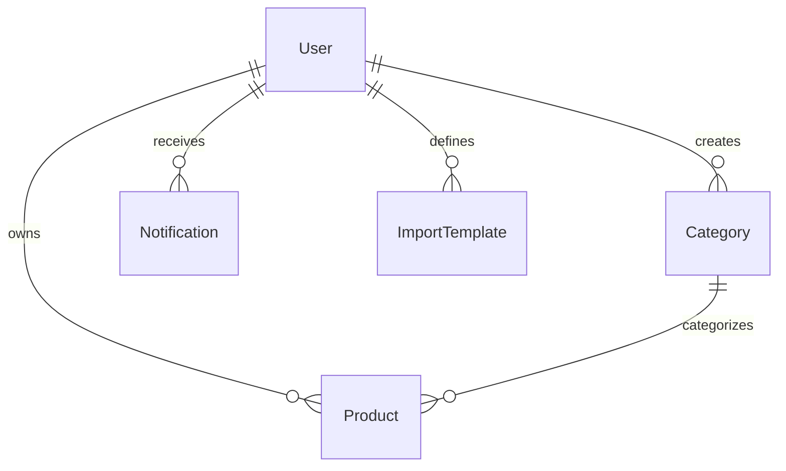

# Esquema do Banco de Dados

O banco de dados é modelado utilizando Prisma. Abaixo estão os principais modelos e seus relacionamentos.

## User

Usuários da plataforma.

- **Relacionamentos**:
  - Possui muitos `Product`.
  - Possui muitas `Category` (se personalizadas).
  - Possui muitas `Notification` e `Activity`.

## Product

Entidade central do sistema.

- **Campos Chave**: `sku`, `price`, `stockQuantity`, `status`.
- **Relacionamentos**:
  - Pertence a uma `Category`.
  - Pertence a um `User` (proprietário).

## Category

Categorização hierárquica ou simples de produtos.

- Categoria pode ser global (sistema) ou personalizada do usuário (`userId`).

## ImportTemplate

Define mapeamentos salvos para importação de CSVs.

- Permite que o usuário salve "De: Nome Coluna CSV -> Para: Nome Campo Produto".

## Notification & Activity

Sistema de rastreabilidade e avisos.

- `Activity`: Log de ações (ex: "Usuário X criou produto Y").
- `Notification`: Alertas diretos para o usuário (ex: "Importação concluída").

---

