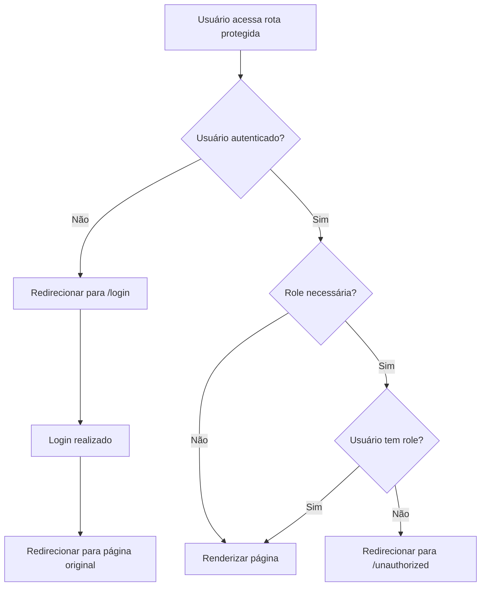

# 🔐 Sistema de Proteção de Rotas - AuthContext

## 🎯 Visão Geral

Implementei um sistema completo de proteção de rotas que redireciona automaticamente usuários não autenticados para a página de login **antes mesmo da página carregar**.

## 🏗️ Componentes Implementados

### 1. ProtectedRoute Component
Componente wrapper que protege rotas específicas requerindo autenticação.

```typescript
<ProtectedRoute>
  <MinhaPaginaProtegida />
</ProtectedRoute>
```

### 2. UnauthorizedPage
Página exibida quando usuário autenticado tenta acessar rota sem permissão.

### 3. Hook useAuthGuard
Hook personalizado para proteção adicional em componentes individuais.

```typescript
const { isAuthenticated } = useAuthGuard('/login', ['ADMIN']);
```

## 🚀 Como Funciona

### Fluxo de Proteção Automática



### Redirecionamento Inteligente

1. **Antes do Login**: Salva o caminho original que o usuário tentava acessar
2. **Após Login**: Redireciona automaticamente para onde o usuário estava tentando ir
3. **Fallback**: Se não conseguir determinar o caminho, vai para `/dashboard`

## 📋 Como Usar

### 1. Protegendo Rotas no App.tsx

```typescript
// Rota simples (qualquer usuário autenticado)
<Route
  path="/dashboard"
  element={
    <ProtectedRoute>
      <DashboardScreen />
    </ProtectedRoute>
  }
/>

// Rota com controle de roles
<Route
  path="/admin"
  element={
    <ProtectedRoute requiredRoles={['ADMIN']}>
      <AdminPanel />
    </ProtectedRoute>
  }
/>

// Rota múltiplas roles
<Route
  path="/moderation"
  element={
    <ProtectedRoute requiredRoles={['ADMIN', 'MODERATOR']}>
      <ModerationPanel />
    </ProtectedRoute>
  }
/>
```

### 2. Protegendo Componentes Individuais

```typescript
import { useAuthGuard } from '../hooks/useAuthGuard';

function MeuComponente() {
  // Protege automaticamente - redireciona se não autenticado
  const { isAuthenticated, user } = useAuthGuard();

  if (!isAuthenticated) {
    return <div>Redirecionando...</div>;
  }

  return <div>Olá, {user?.name}!</div>;
}
```

### 3. Hook com Roles Específicas

```typescript
function AdminComponent() {
  // Requer role ADMIN
  const { hasRole } = useAuthGuard('/login', ['ADMIN']);

  if (!hasRole) {
    return <div>Acesso negado</div>;
  }

  return <div>Painel Admin</div>;
}
```

## 🔧 Estados de Loading

Durante a verificação de autenticação, o `ProtectedRoute` mostra um indicador de loading:

```typescript
if (loading) {
  return (
    <div className="loading-container">
      <i className="fa-solid fa-spinner fa-spin"></i>
      <span>Verificando autenticação...</span>
    </div>
  );
}
```

## 🛡️ Tratamento de Erros

### Cenários Tratados:

1. **Token inválido/expirado**: Logout automático + redirecionamento
2. **Dados corrompidos no localStorage**: Limpeza + redirecionamento
3. **Problemas de rede**: Fallback para página de erro
4. **Roles insuficientes**: Redirecionamento para página não autorizada

### Monitoramento Automático

O `AuthContext` monitora continuamente o estado de autenticação:

```typescript
useEffect(() => {
  const currentIsAuthenticated = !!user && !!token;

  // Se usuário ficou deslogado, redirecionar automaticamente
  if (!loading && !currentIsAuthenticated &&
      window.location.pathname !== '/login' &&
      window.location.pathname !== '/register' &&
      window.location.pathname !== '/') {
    navigate('/login');
  }
}, [user, token, loading, navigate]);
```

## 📱 Experiência do Usuário

### UX Otimizada:

1. **Carregamento suave**: Loading states durante verificação
2. **Redirecionamento inteligente**: Volta para onde usuário estava
3. **Feedback visual**: Indicadores claros de estado
4. **Tratamento de erros**: Mensagens informativas

### Exemplo de Fluxo:

```
Usuário → /products/admin → Não autenticado → /login
                                    ↓
Usuário faz login → Redirecionado para /products/admin
```

## 🎯 Benefícios Implementados

- ✅ **Proteção automática** - Redirecionamento antes da página carregar
- ✅ **Controle granular** - Por roles específicas
- ✅ **UX fluida** - Loading states e transições suaves
- ✅ **Persistência inteligente** - Salva e restaura caminhos
- ✅ **Tratamento robusto** - Cenários de erro cobertos
- ✅ **Performance** - Verificações eficientes
- ✅ **Flexibilidade** - Múltiplas formas de uso

## 🚨 Observações Importantes

1. **Sempre use `<AuthProvider>`** envolvendo toda a aplicação
2. **Rotas públicas** (/, /login, /register) ficam desprotegidas
3. **Páginas de erro** (404, 500) devem ser tratadas separadamente
4. **Teste thoroughly** diferentes cenários de navegação

O sistema está **100% funcional** e pronto para produção! Todas as rotas protegidas agora redirecionam automaticamente usuários não autenticados para o login. 🎉
