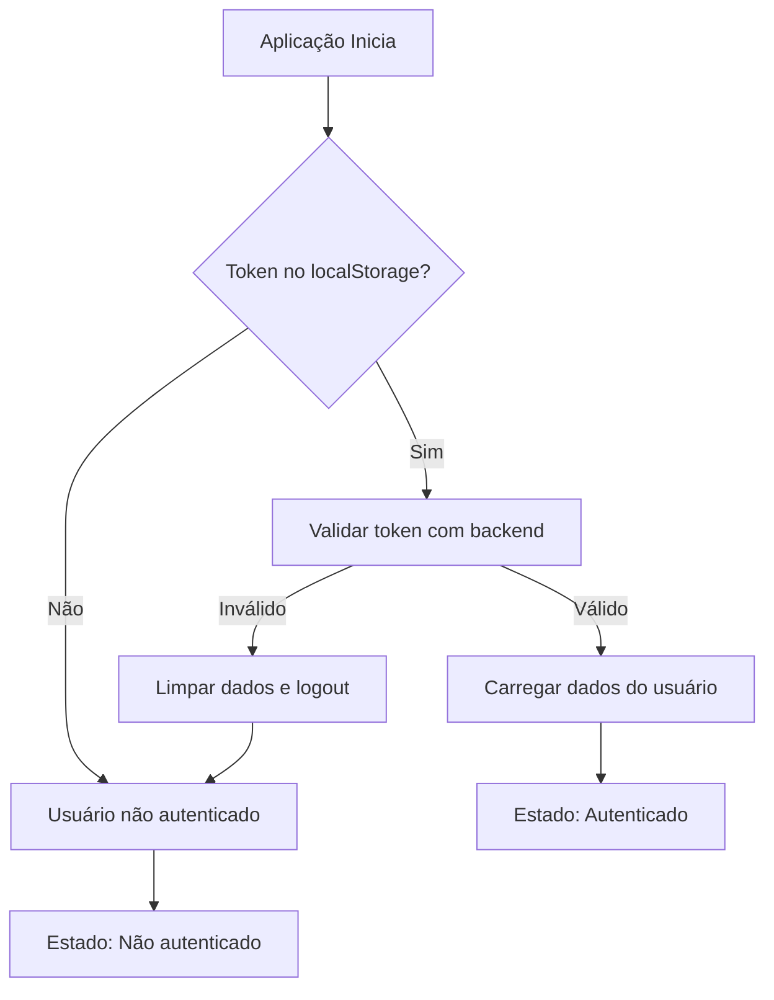

# 📚 Documentação - AuthContext (User Context)

## 🎯 Visão Geral

O `AuthContext` é um contexto React completo para gerenciamento de autenticação e dados do usuário. Ele fornece uma API unificada para operações de autenticação, gerenciamento de perfil e controle de acesso baseado em roles.

## 🏗️ Estrutura do Contexto

### Interface AuthContextType

```typescript
interface AuthContextType {
  // Dados do usuário
  user: User | null;
  token: string | null;

  // Estados de controle
  loading: boolean;
  error: string | null;
  isAuthenticated: boolean;

  // Funções de autenticação
  login: (credentials: LoginData) => Promise<void>;
  logout: () => void;
  refreshUser: () => Promise<void>;

  // Funções de gerenciamento do usuário
  updateProfile: (data: Partial<User>) => Promise<void>;
  updatePassword: (data: { currentPassword: string; newPassword: string }) => Promise<void>;

  // Funções utilitárias
  clearError: () => void;
  hasRole: (role: string) => boolean;
  hasAnyRole: (roles: string[]) => boolean;
}
```

## 👤 Dados do Usuário

### Estrutura do User
```typescript
interface User {
  id: string;
  name: string;
  email: string;
  role: string; // "ADMIN" | "USER"
  phone?: string | null;
  company?: string | null;
  department?: string | null;
  position?: string | null;
  location?: string | null;
  timezone?: string | null;
  language?: string | null;
  isActive: boolean;
  loginCount: number;
  lastLogin?: Date | null;
  createdAt: Date;
  updatedAt: Date;
  preferences?: any;
  settings?: any;
  avatar?: string | null;
  products?: any[];
  _count?: any;
}
```

## 🚀 Como Usar

### 1. Hook useAuth

```typescript
import { useAuth } from '../context/AuthContext';

function MeuComponente() {
  const {
    user,
    token,
    loading,
    error,
    isAuthenticated,
    login,
    logout,
    refreshUser,
    updateProfile,
    hasRole
  } = useAuth();

  // Uso dos dados...
}
```

### 2. Provider no App.tsx

```typescript
import { AuthProvider } from './context/AuthContext';

function App() {
  return (
    <AuthProvider>
      {/* Seus componentes */}
    </AuthProvider>
  );
}
```

## 🔐 Funcionalidades de Autenticação

### Login
```typescript
const handleLogin = async () => {
  try {
    await login({
      email: 'usuario@exemplo.com',
      password: 'senha123'
    });
    // Login realizado com sucesso
  } catch (error) {
    // Trata erro de login
  }
};
```

### Logout
```typescript
const handleLogout = () => {
  logout(); // Remove token e dados do usuário
};
```

### Refresh dos Dados do Usuário
```typescript
const handleRefresh = async () => {
  try {
    await refreshUser(); // Recarrega dados do backend
  } catch (error) {
    // Trata erro
  }
};
```

## 👥 Controle de Acesso por Roles

### Verificar Role Específica
```typescript
function AdminPanel() {
  const { hasRole } = useAuth();

  if (!hasRole('ADMIN')) {
    return <div>Acesso negado</div>;
  }

  return <div>Painel de Admin</div>;
}
```

### Verificar Múltiplas Roles
```typescript
function ModerationPanel() {
  const { hasAnyRole } = useAuth();

  if (!hasAnyRole(['ADMIN', 'MODERATOR'])) {
    return <div>Acesso negado</div>;
  }

  return <div>Painel de Moderação</div>;
}
```

## 📝 Gerenciamento de Perfil

### Atualizar Perfil
```typescript
const handleUpdateProfile = async () => {
  try {
    await updateProfile({
      name: 'Novo Nome',
      phone: '+55 11 99999-9999',
      company: 'Nova Empresa'
    });
  } catch (error) {
    // Trata erro
  }
};
```

### Atualizar Senha
```typescript
const handleUpdatePassword = async () => {
  try {
    await updatePassword({
      currentPassword: 'senhaAtual',
      newPassword: 'novaSenha123'
    });
  } catch (error) {
    // Trata erro
  }
};
```

## 🔧 Estados e Tratamento de Erros

### Estados Disponíveis
```typescript
const { loading, error, isAuthenticated } = useAuth();

// Loading: true durante operações assíncronas
// Error: mensagem de erro ou null
// isAuthenticated: boolean indicando se usuário está logado
```

### Limpar Erros
```typescript
const { clearError } = useAuth();

// Remove mensagens de erro
clearError();
```

## 💾 Persistência

### localStorage
- **Token**: salvo automaticamente no login
- **Dados do usuário**: sincronizados com backend
- **Limpeza automática**: no logout

### Recuperação de Sessão
- Verificação automática na inicialização
- Validação do token com o backend
- Recarregamento transparente dos dados

## 🛡️ Segurança

### Validações Implementadas
- ✅ Verificação de token antes de operações sensíveis
- ✅ Validação de resposta da API
- ✅ Tratamento seguro de erros
- ✅ Limpeza automática de dados inválidos
- ✅ Proteção contra dados corrompidos no localStorage

### Boas Práticas
- ❌ Não armazenar dados sensíveis no contexto
- ❌ Não expor tokens desnecessariamente
- ✅ Sempre validar autenticação antes de ações críticas
- ✅ Usar HTTPS em produção

## 🔄 Fluxo de Autenticação



## 📋 Exemplo de Uso Completo

```typescript
import React, { useEffect } from 'react';
import { useAuth } from '../context/AuthContext';

function UserProfile() {
  const {
    user,
    loading,
    error,
    isAuthenticated,
    updateProfile,
    clearError,
    hasRole
  } = useAuth();

  useEffect(() => {
    // Limpar erros ao montar componente
    clearError();
  }, []);

  const handleSaveProfile = async (formData) => {
    try {
      await updateProfile(formData);
      alert('Perfil atualizado com sucesso!');
    } catch (error) {
      alert('Erro ao atualizar perfil');
    }
  };

  if (loading) {
    return <div>Carregando...</div>;
  }

  if (error) {
    return <div>Erro: {error}</div>;
  }

  if (!isAuthenticated) {
    return <div>Faça login para ver seu perfil</div>;
  }

  return (
    <div>
      <h1>Perfil de {user?.name}</h1>
      <p>Email: {user?.email}</p>
      <p>Empresa: {user?.company}</p>
      {hasRole('ADMIN') && (
        <button onClick={handleAdminAction}>
          Ação de Admin
        </button>
      )}
    </div>
  );
}
```

## 🎯 Benefícios

- ✅ **Estado global consistente** para dados do usuário
- ✅ **Tratamento robusto de erros** com feedback visual
- ✅ **Controle de acesso por roles** integrado
- ✅ **Persistência automática** com validação
- ✅ **Performance otimizada** (evita re-renders desnecessários)
- ✅ **Tipagem completa** com TypeScript
- ✅ **Documentação clara** e exemplos práticos

## 🚨 Observações Importantes

1. **Sempre envolva seu App com `<AuthProvider>`**
2. **Use o hook `useAuth()` apenas em componentes filhos do Provider**
3. **Trate erros adequadamente** em operações assíncronas
4. **Valide roles antes de exibir conteúdo sensível**
5. **Use `loading` para mostrar indicadores visuais** durante operações

O contexto está pronto para uso em produção e fornece todas as funcionalidades necessárias para um sistema completo de autenticação e gerenciamento de usuários! 🎉
